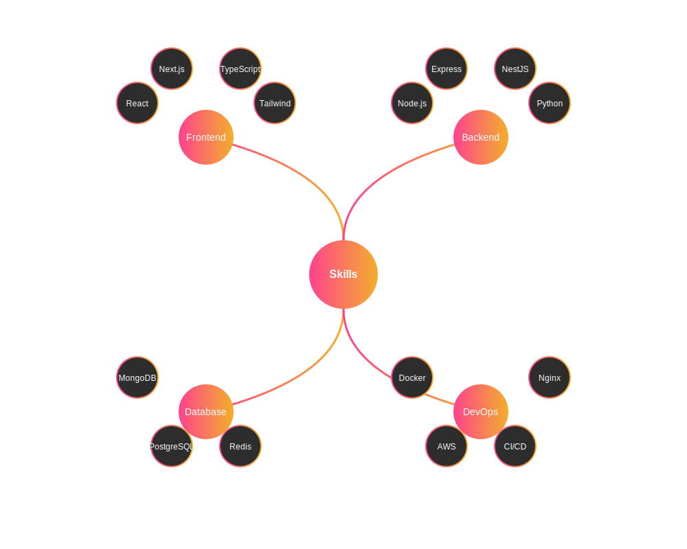

<!-- Header Banner -->
<div align="center">
  
</div>

<!-- Animated Introduction -->
<div align="center">
  
</div>

<!-- Profile Views & Time Zone -->
<div align="center">
  
  
</div>

<!-- Separator -->
</p>
  
<!-- Quick Navigation Menu - NEW -->
<div align="center">
  <a href="#skills">🛠️ Skills</a> •
  <a href="#projects">🚀 Projects</a> •
  <a href="#stats">📊 Stats</a> •
  <a href="#connect">🤝 Connect</a>
</div>

<!-- About Me Section -->
<h2 align="left">
   Who am I?
</h2>

```javascript
const IliasAhmed = {
  pronouns: "He" | "Him",
  country: "India 🇮🇳",
  currentFocus: "Building Scalable Web Applications",
  funFact: "I can code for hours with just coffee ☕",
  hobbies: ["Coding", "Problem Solving", "Reading Tech Blogs"],
  ambitions: ["Self Development", "Build Impactful Projects"],
};
```

<!-- Tech Stack Section -->
<h2 align="left" id="skills">
   Technical Skills
</h2>

<div align="center">
  <!-- Frontend -->
  <h3>🎨 Frontend Technologies</h3>
  <p>
    
    
     
    
  </p>

  <!-- Backend -->
  <h3>⚡ Backend Powerhouse</h3>
  <p>
    
    
  </p>

  <!-- Database -->
  <h3>🛢️ Database Management</h3>
    <p>
    
    </p>
</div>

<!-- NEW: Interactive Skills Tree -->
<details>
<summary>🌳 Expand Skills Tree</summary>
<br>
<div align="center">
  <!-- Will be rendered using custom JavaScript -->
  
</div>
</details>

<!-- NEW: Featured Projects Section -->
<h2 id="projects" id="projects">
   Featured Projects
</h2>

<div align="center">
<table>
  <tr>
    <td width="50%">
      <h3 align="center">Project 1</h3>
      <div align="center">  
        <a href="PROJECT_URL" target="_blank">
          
        </a>
        <p>
          <a href="https://github.com/username/repo" target="_blank">
            
          </a>  
          <a href="PROJECT_URL" target="_blank">
            
          </a>
        </p>
        <p><strong>React, Node.js, MongoDB</strong> - Your project description here</p>
      </div>
    </td>
    <td width="50%">
      <h3 align="center">Project 2</h3>
      <div align="center">  
        <a href="PROJECT_URL" target="_blank">
          
        </a>
        <p>
          <a href="https://github.com/username/repo" target="_blank">
            
          </a>  
          <a href="PROJECT_URL" target="_blank">
            
          </a>
        </p>
        <p><strong>Next.js, TypeScript, TailwindCSS</strong> - Your project description here</p>
      </div>
    </td>
  </tr>
</table>
</div>

<!-- GitHub Stats Section -->
<h2 align="left" id="stats">
   GitHub Analytics
</h2>

<!-- Main Stats -->
<p align="center">
  
  
</p>

<!-- Language Stats -->
<p align="center">
  
</p>

<!-- Activity Graph -->

[](https://github.com/ashutosh00710/github-readme-activity-graph)

<!-- Trophies -->
<p align="center">
  
</p>

<!-- Profile Summary -->
<p align="center">
  
</p>
  
<!-- Connect Section -->
<div align="center" id="connect">
  
  
  <!-- Primary Social Links -->
  <p align="center">
    <a href="https://linkedin.com/in/ilias-ahmed9613">
      
    </a>
    <a href="https://twitter.com/your-twitter">
      
    </a>
   <a href="https://your-portfolio-url.com">
     
   </a>
  </p>

<!-- Separator -->


  <!-- Contact Options -->
  <p align="center">
    <a href="mailto:your.email@gmail.com">
      
    </a>
    <a href="https://calendly.com/your-username">
      
    </a>
    <a href="https://discord.gg/NMQJcagw">
      
    </a>
  </p>

  <!-- Developer Platforms -->
  <p align="center">
    <a href="https://dev.to/your-username">
      
    </a>
    <a href="https://medium.com/@your-username">
      
    </a>
    <a href="https://stackoverflow.com/users/your-id">
      
    </a>
  </p>
</div>

<!-- Footer Section -->
<div align="center">
  <!-- Random Dev Quote -->
  

  <!-- Contribution Snake -->
  <picture>
    <source media="(prefers-color-scheme: dark)" srcset="https://raw.githubusercontent.com/platane/platane/output/github-contribution-grid-snake-dark.svg">
    <source media="(prefers-color-scheme: light)" srcset="https://raw.githubusercontent.com/platane/platane/output/github-contribution-grid-snake.svg">
    
  </picture>
</div>

<!-- Final Separator -->
  
